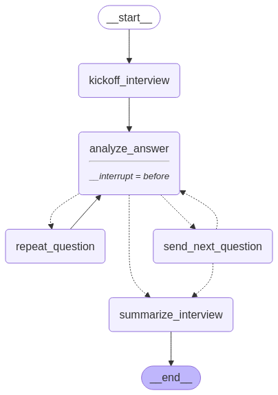

# AI Interview

An AI-powered technical interview system that conducts automated interviews using Large Language Models.

## System Workflow



The interview system follows a structured workflow:
1. **Kickoff Interview**: Begins the interview with initial question
2. **Analyze Answer**: Evaluates candidate responses
3. **Repeat Question**: Repeats the question if the answer is not valid
4. **Send Next Question**: Sends the next question to the candidate
5. **Summarize Interview**: Summarizes the interview

## Features

### Core Features

#### Multi-language Support
- Supports both English and Chinese interviews
- Automatic language detection and response
- Consistent evaluation across languages

#### Dynamic Interview Process
- Customizable job roles and requirements
- Knowledge point-based question generation
- Adaptive difficulty based on candidate responses
- Real-time interview progress tracking

#### Answer Analysis
- Real-time response evaluation
- Structured feedback generation
- Technical accuracy assessment
- Code review and analysis
- Answer completeness checking

#### Interview Control
- Time tracking and management
- Interview pause/resume capability
- Manual interview termination ("End Interview" command)
- "Give up" option for difficult questions

#### Result Generation
- Comprehensive interview summary
- Technical skill assessment
- Knowledge coverage report
- Score breakdown by topic
- Improvement suggestions

### Technical Features

#### State Management
- Persistent interview state
- Recoverable interview sessions
- Question-answer history tracking
- Interview checkpoint system

#### Logging System
- Detailed interview logs
- Debug information for development
- Performance metrics tracking
- Error handling and reporting

#### Configuration
- Customizable model selection
- Adjustable interview parameters
- Environment-based settings
- Prompt template management

## Installation

### Install from source
```bash
git clone <git repo url>
cd ai-interview
pip install -r requirements.txt
```

## Usage

### Basic Usage

```python
from agent.workflow import build_graph
from datetime import datetime

# Initialize interview
graph = build_graph()

# Configure interview parameters
inputs = {
    "job_title": "Python Developer",
    "knowledge_points": [
        "Python",
        "Data Structures",
        "Algorithms",
        "System Design"
    ],
    "interview_time": 30,  # minutes
    "language": "English",  # or "Chinese"
    "start_time": datetime.now(),
    "qa_history": []
}

# Run interview
for output in graph.stream(inputs):
    if "user_answer" in output:
        # Get user's answer when prompted
        answer = input("Your answer: ")
        # Use "End Interview" to terminate the interview
        output["user_answer"] = answer
```

### Interview Commands
- `Stop Interview` - Terminate the interview
- `Give up` - Skip current question
- `Ctrl+C` - Emergency stop

## Configuration

### Environment Variables
Create a `.env` file in your project root:

```bash
# Required: OpenAI API configuration
OPENAI_API_KEY=your-api-key
OPENAI_BASE_URL=your-base-url
```

### Model Configuration
The system uses GPT-4 by default. You can configure different models:
```python
config = {"configurable": {"model_name": "gpt-4o"}}
graph.stream(inputs, config=config)
```

## Requirements

- Python >= 3.10
- Dependencies:
  - langchain >= 0.3.12
  - langchain-openai >= 0.2.12
  - langgraph >= 0.2.59
  - pydantic >= 2.10.3
  - python-dotenv >= 1.0.1
  - loguru >= 0.7.3

## AI Agent Project Structure

```
ai-interview/
├── agent/
│   ├── prompts/          # Interview prompt templates
│   │   ├── kickoff_interview.txt
│   │   ├── analyze_answer.txt
│   │   └── summarize_interview.txt
│   ├── workflow.py       # Main interview workflow
│   ├── qa_analyzer.py    # Answer analysis
│   └── agent_state.py    # State management
└── utils/
    ├── llm.py           # LLM configuration
    ├── log_utils.py     # Logging utilities
    └── prompt_utils.py  # Prompt handling
```

## API Project Structure

```
api/
├── __init__.py
├── main.py
├── conf/           # Configuration files
├── doc/           # API documentation
├── middleware/    # Middleware components
├── model/        # Data models
├── router/       # Route handlers
├── service/      # Business logic
├── utils/        # Utility functions
└── logs/         # Log files
```

## API Installation

1. Create virtual environment (recommended):
```bash
python -m venv venv
source venv/bin/activate  # Linux/Mac
# or
.\venv\Scripts\activate  # Windows
```

2. Install dependencies:
```bash
pip install -r requirements.txt
```

## Running the Service

Start the server:
```bash
uvicorn api.main:app --reload
```

The service will be running at http://localhost:8000

## API Documentation

Access Swagger documentation at:
- http://localhost:8000/api/v1/docs

## API Examples

### Health Check

```bash
# Check service health status
curl http://localhost:8000/api/v1/health

# Expected response:
# {"status": "ok"}
```

### API Testing

Run tests using pytest:
```bash
# install the package
pip install -e .

# run pytest
pytest tests/api -v
```

## License

This project is licensed under the Apache License 2.0 - see the [LICENSE](LICENSE) file for details. 

## API 文档

API 文档可在 `/api/v1/doc` 路径下访问。

### API 测试

详细的 API 测试命令请参考 [curl-test.md](curl-test.md) 文件。

### Create Test

```bash
# Create a test
curl -X POST http://localhost:8000/api/v1/test \
  -H "Content-Type: application/json" \
  -d '{
    "test_id": "test001",
    "type": "coding",
    "language": "python",
    "difficulty": "medium",
    "create_date": "2024-03-20T10:00:00"
  }'

# Expected response:
# {
#   "code": "0",
#   "message": "success",
#   "data": {
#     "test_id": "test001",
#     "status": "created"
#   }
# }
``` 